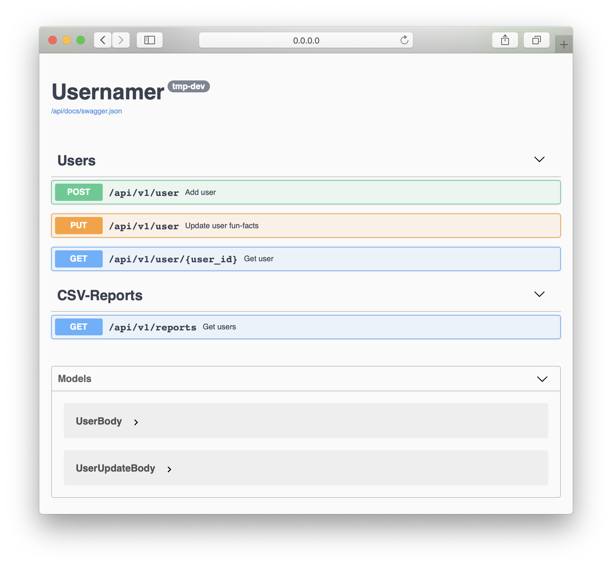

# Usernamer

Service for adding interesting facts about user's birthday through [NumersApi](http://numbersapi.com).

Also allows to update facts (if previous was boring) and form csv-report with users info.
## How to use

Create .env file with following notation
```
POSTGRES_USER=##
POSTGRES_NAME=##
POSTGRES_PASSWORD=##
POSTGRES_PORT=##
POSTGRES_EXTERNAL_PORT=##
LOG_LEVEL=DEBUG
SENTRY_DSN=''
EXTERNAL_APP_PORT=##
APP_PORT=##
PYTHONPATH=.
```

Launch within docker-container
```bash
docker-compose up -d
```
Make migrations
```bash
docker-compose run --rm app alembic upgrade head
```

## OpenApi (Swagger) documentation

